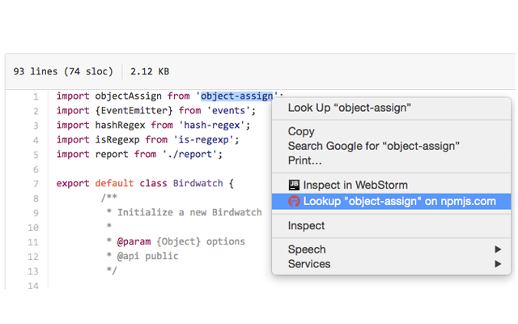

#  NPM Lookup

> Chrome ContextMenu Extension - Turn selected text into a quick npm package lookup.

## Usage

1. Select some text on a webpage (like on GitHub's source code viewer)
2. Right click
3. Select `Lookup on npmjs.com` from the context menu. 

...Then, :boom: **BOOM!** you have saved precious time. 

**Pro Tip:** Use this extension all over GitHub's JavaScript source code viewer. You can select the text inside of `require()` or `import` statements to quickly review the npm profiles of JavaScript modules. 

## Install

* [Chrome extension](https://chrome.google.com/webstore/detail/github-npm-lookup/ijgbachgpjabdghaghpngjhkmimojodg)

## Related

- [npms-lookup-cli](https://github.com/radiovisual/npms-lookup-cli) Search npm packages on npms.io from the command line.
- [npm-lookup-cli](https://github.com/radiovisual/npm-lookup-cli) Lookup npm packages on npmjs.org from the command line.

## License

MIT © [Michael Wuergler](http://numetriclabs.com)

